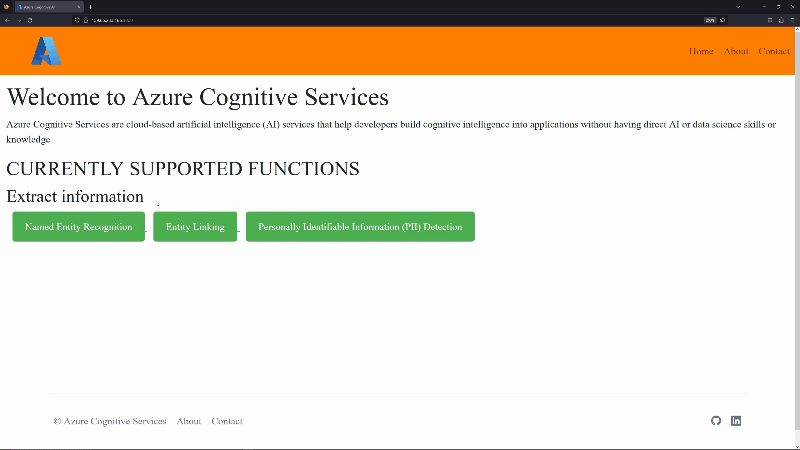

# Entity Recognition API Using Azure Cognitive Services


## Description
The API serves as an intermediary between the Client and Azure Cognitive Service for Language. It operates as a RESTful API that utilizes HTTP requests for both data retrieval and submission.

---

## Quick Links
- [x] [Working Application](http://159.65.233.166:3000/)
- [x] [API Playground (Swagger)](http://159.65.233.166:3000/api-docs/)

---

## Demo

#### Working Application
 

#### API Playground (Swagger)
 
  
---
  
## Table of Contents
- [ ] [Description](#description)
  - [ ] [Quick Links](#quick-links)
  - [ ] [Demo](#demo)
  [ ] [Table of Contents](#table-of-contents)
- [ ] [Features](#features)
- [ ] [Getting Started](#getting-started)
- [ ] [Endpoints](#endpoints)
  - [ ] [Demo Application Endpoints](#demo-application-endpoints)
  - [ ] [API Endpoints - JSON response](#api-endpoints---json-response)
- [ ] [Using the API](#using-the-api)
  - [ ] [Example Request Query](#example-post-apinamed)
  - [ ] [Example Response](#expected-response-1) 
  - [ ] [Invalid Request Query](#invalid-resquest--response-examples)
  - [ ] [Example Response](#expected-response-4) 
- [ ] [Q&A](#qa)
- [ ] [Authors](#authors)
- [ ] [License](#license)
  

---

## Features
| Features                    | Description                                                             |
| --------------------------- | ----------------------------------------------------------------------- |
| Named Entity Recognition   |  Identify and categorize entities in unstructured text. For example: people, places, organizations, and quantities  |
| Entity Linking   | Identifies and disambiguates the identity of entities found in text. For example, in the sentence "Hi, I'm Bill Gates", the words "Bill Gates" would be identified, with a link to more information on Wikipedia  |
| PII Detection   |   Identify, categorize, and redact sensitive information in unstructured text. For example: phone numbers, email addresses, and forms of identification  |
| Language Detection   |   Automatically detect the user's language when performing the above features |
  
  
<br>

## Getting Started

---

#### For the program, you will need the following dependencies:

- [x] [Git](https://github.com/git-guides/install-git)
- [x] [Node.js](https://nodejs.dev/en/learn/how-to-install-nodejs/)
- [x] [Azure Cognitive Services (API Key and Endpoint)](https://learn.microsoft.com/en-us/azure/cognitive-services/cognitive-services-apis-create-account?tabs=multiservice%2Canomaly-detector%2Clanguage-service%2Ccomputer-vision%2Cwindows)

#### To run the program, follow these steps:

1. Clone the repo and navigate to it.
```bash
git clone https://github.com/username/repo-name.git
cd repo-name
```
2. Run "npm install".
3. Set up environment variables in the `config` folder. Create a `.env` file and add the following as `key=value`:
```javascript
HOST = Your Host Address
PORT = Port Number //(ex: 3000)
ENDPOINT = API ENDPOINT // ENDPOINT address from Azure Cognitive Services
TEXT_ANALYTICS_API_KEY = API KEY // API key from Azure Cognitive Services
```
4. Run "npm start".
---
  
## Endpoints
---

### Demo Application Endpoints


| Endpoint           | Description                                                             |
| ------------------ | ----------------------------------------------------------------------- |
| `POST /entity/named`   |   Performs Named Entity Recognition for the provided text                   |
| `GET /entity/named/languages`   | Returns the list of languages supported by Named Entity Recognition                     |
| `POST /entity/linking`   |   Performs Entity Linking for the provided text                   |
| `GET /entity/linking/languages`   | Returns the list of languages supported by Entity Linking                     |
| `POST /entity/pii`   |   Performs Personally Identifiable Information (PII) detection for the provided text      |
| `GET /entity/pii/languages`   | Returns the list of languages supported by PII                    |
  
  
---

<a href="http://159.65.233.166:3000/"></a>
 
  
---
---


 ### API Endpoints - JSON response
| Endpoint           | Description                                                             |
| ------------------ | ----------------------------------------------------------------------- |
| `POST /api/named`   |   Performs Named Entity Recognition for the provided text                   |
| `GET /api/named/languages`   | Returns the list of languages supported by Named Entity Recognition                     |
| `POST /api/linking`   |   Performs Entity Linking for the provided text                   |
| `GET /api/linking/languages`   | Returns the list of languages supported by Entity Linking                     |
| `POST /api/pii`   |   Performs Personally Identifiable Information (PII) detection for the provided text      |
| `GET /api/pii/languages`   | Returns the list of languages supported by PII                    |
  
  
 ### Using the API

---

To get the supported languages, send a GET request to the endpoint.
#### Example: GET /api/linking/languages

#### Expected Response
```json
{
  "en": {
    "name": "English"
  },
  "es": {
    "name": "Spanish"
  }
}
```

<br>

---

To use the API and its cognitive features, send a POST request to the endpoint. The request body should be in JSON format and should contain the following field:
- [x] `sendText`: The text to used for recognition/detection

---

#### Example: POST /api/named

```json
{
  "sendText": "Hi, I'm Bill Gates"
}
```

#### Expected Response
```json
[
  {
    "id": "1",
    "warnings": [],
    "entities": [
      {
        "text": "Bill Gates",
        "category": "Person",
        "offset": 8,
        "length": 10,
        "confidenceScore": 1
      }
    ]
  }
]
```

<br>

---

#### Example: POST /api/linking

```json
{
  "sendText": "Hi, I'm Bill Gates"
}
```

#### Expected Response
```json
[
  {
    "id": "1",
    "warnings": [],
    "entities": [
      {
        "name": "Bill Gates",
        "matches": [
          {
            "confidenceScore": 0.14,
            "text": "Bill Gates",
            "offset": 8,
            "length": 10
          }
        ],
        "language": "en",
        "dataSourceEntityId": "Bill Gates",
        "url": "https://en.wikipedia.org/wiki/Bill_Gates",
        "dataSource": "Wikipedia",
        "bingEntitySearchApiId": "0d47c987-0042-5576-15e8-97af601614fa"
      }
    ]
  }
]
```

<br>

---

#### Example: POST /api/pii

```json
{
  "sendText": "My cell is 9801234567"
}
```

#### Expected Response
```json
[
  {
    "id": "1",
    "warnings": [],
    "redactedText": "My cell is **********",
    "entities": [
      {
        "text": "9801234567",
        "category": "PhoneNumber",
        "offset": 11,
        "length": 10,
        "confidenceScore": 0.8
      }
    ]
  }
]
```


---

<br>

### Invalid Resquest & Response Examples

#### POST /api/named

```json
{
  "sendText": ""
}
```

#### Expected Response
```json
{
  "message": "Please provide an input",
  "status": 400
}
```
<br>

#### POST /api/named

```json
{
  "sendText": "แมวเหมียวน่ารักมากๆ ครับ"
}
```

#### Expected Response
```json
{
  "message": "Language not supported",
  "status": 400
}
```

---

<br>

## Q&A
---

### How do I get an API Key?
- [ ] [Create a Cognitive Services resource in the Azure portal](https://learn.microsoft.com/en-us/azure/cognitive-services/cognitive-services-apis-create-account?tabs=multiservice%2Canomaly-detector%2Clanguage-service%2Ccomputer-vision%2Cwindows)

- [ ] [Get the keys for your resource](https://learn.microsoft.com/en-us/azure/cognitive-services/cognitive-services-apis-create-account?tabs=multiservice%2Canomaly-detector%2Clanguage-service%2Ccomputer-vision%2Cwindows#get-the-key-and-endpoint-for-your-resource:~:text=to%20your%20account.-,Get%20the%20keys%20for%20your%20resource,-After%20your%20resource)


<br>

## Author
---

##### An Hoang

<a href="https://www.linkedin.com/in/anhoangcs/"></a>
<a href="https://github.com/anvanhoang2014"></a>